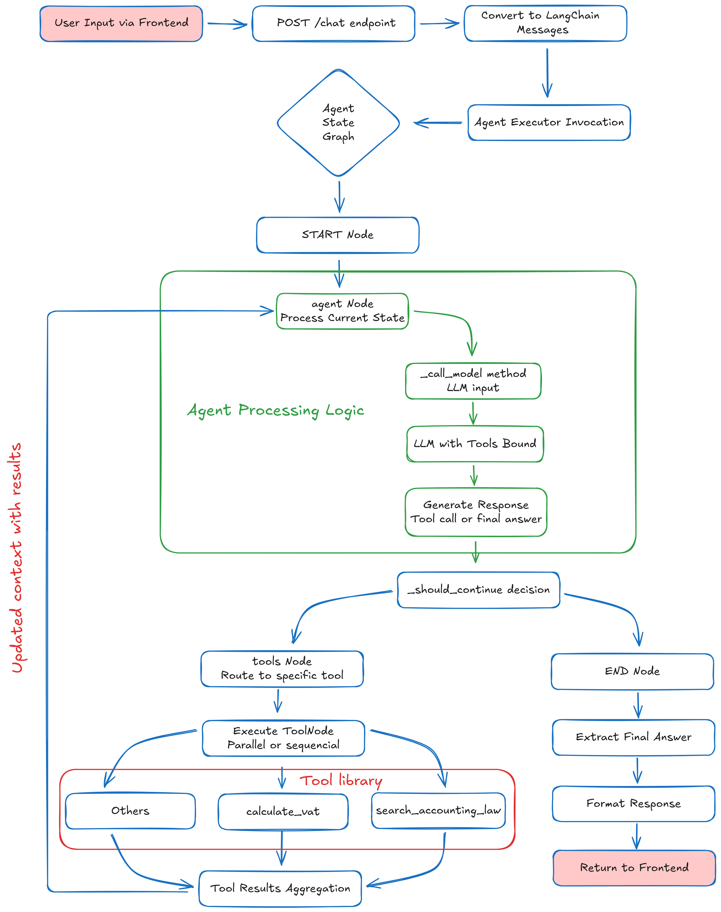

## Project Architecture Diagram



## Key Components and Their Roles

### 1. **Frontend (React/TypeScript)**
- Provides chat interface
- Manages conversation history
- Sends requests to `/chat` endpoint
- Displays formatted responses with Markdown

### 2. **Backend API (FastAPI)**
- `/chat` endpoint: Main entry point
- Message conversion: Frontend ↔ LangChain format
- Error handling and logging
- CORS middleware for cross-origin requests

### 3. **Agent System (LangGraph)**
- **AccountingAgent**: Main orchestrator
- **StateGraph**: Defines workflow (agent → tools → agent → end)
- **ToolNode**: Executes tools when requested
- **Conditional routing**: _should_continue() decides next step

### 4. **LLM Integration (Groq)**
- Model: `meta-llama/llama-4-scout-17b-16e-instruct`
- Temperature: 0 (deterministic responses)
- Tools bound: search_accounting_law, calculate_vat
- System prompt enforces RAG behavior

### 5. **Tools**
- **search_accounting_law**: Vector search in accounting documents
- **calculate_vat**: VAT/percentage calculations
- Both include validation, error handling, and logging

### 6. **Knowledge Base**
- **Supabase**: Vector database with `documents` table
- **Embeddings**: Google Generative AI (text-embedding-004)
- **Documents**: Vietnamese accounting laws, circulars, decrees

### 7. **Configuration & Prompts**
- **config.py**: Centralized settings (model, API keys, tools)
- **prompts.py**: SYSTEM_PROMPT with strict RAG rules
- **agent_types.py**: Type definitions for state and routing

## Detailed Component Flow

### 1. Frontend to Backend Communication
```
Frontend (React/TypeScript) 
    → POST /chat with {messages: [...]}
    → FastAPI backend receives request
    → Convert to LangChain HumanMessage/AIMessage
```

### 2. Agent Execution Flow
```
LangChain Messages → Agent Executor → State Graph:
    Step 1: START → agent node
    Step 2: _call_model() with current state
    Step 3: LLM processes messages with system prompt
    Step 4: Check if tool calls are needed
    Step 5: If tools needed → tools node → execute tools → loop back
    Step 6: If final answer → END → extract content
```

### 3. Tool Execution Path
```
When LLM requests tools:
    → ToolNode executes requested tool
    → search_accounting_law: 
        - Query → embeddings → Supabase vector search
        - Format results → return to agent
    → calculate_vat:
        - Parse inputs → calculate → format → return
    → Tool results added to messages
    → Loop back to agent node
```

### 4. State Management
```
AgentState contains:
    - messages: list of conversation messages
    - step_count: iteration counter
    - debug_enabled: logging flag
    
State transitions:
    agent → tools → agent → ... → end
    (Maximum 10 steps via Config.MAX_AGENT_STEPS)
```

### 5. Response Processing
```
Final state → Extract last message → Process content:
    - String: use directly
    - List of blocks: extract text parts
    - Other: convert to string
    → Return {"answer": final_answer}
```

## Error Handling Flow

```
Exception → Logging → Graceful Response:
    - Model errors: Return error message in AIMessage
    - Tool errors: Return formatted error to agent
    - API errors: HTTP 500 with detail
    - Validation errors: Early rejection with message
```

## Performance Considerations

1. **Agent Loop Limit**: 10 steps maximum prevents infinite loops
2. **Vector Search**: Uses Supabase RPC for efficient similarity matching
3. **Caching**: No explicit caching; relies on LLM provider caching
4. **Concurrency**: FastAPI handles multiple requests asynchronously

## Monitoring and Debugging

- **Logging**: Detailed logs at each step when debug_enabled=True
- **Step counting**: Tracks iterations to prevent infinite loops
- **State inspection**: get_agent_state_summary() for debugging
- **Error tracking**: Comprehensive exception handling with traceback

## Deployment Considerations

- **Environment variables**: API keys, Supabase credentials
- **Dependencies**: Managed via requirements.txt
- **Scalability**: Stateless agent execution allows horizontal scaling
- **Security**: CORS configured, API keys in environment

```
This architecture ensures a robust, maintainable system that follows RAG principles while providing accurate accounting information through tool usage.